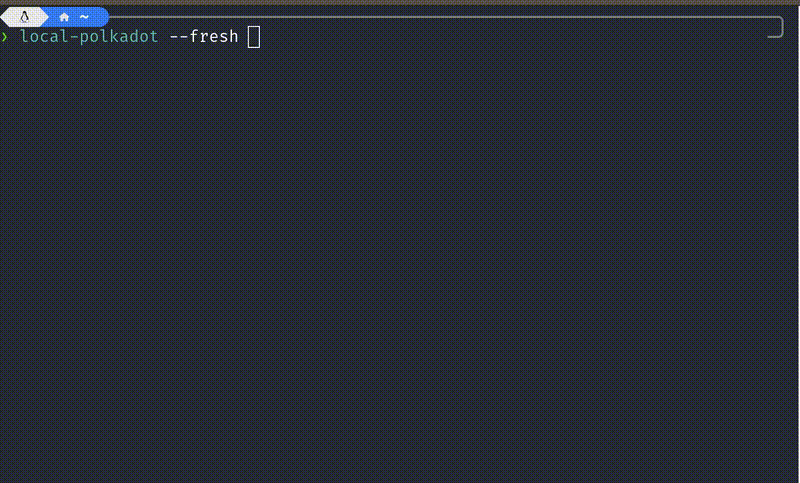

# Local Polkadot


Have you ever tried interacting with the Polkadot network using `polkadot.js.org/apps` and found it to be frustratingly slow?

Too much load on the rpc server can lead to a bad user experience. 

Or maybe you just want a single command to setup a local polkadot-rpc node and explorer instance? 

## Enter local-polkadot

Instead of 
 - start two terminals
 - download or compile the latest polkadot exe and polkadot-js/apps 
 - run chmod +x polkadot
 - run yarn install, yarn run start

You can just 
```sh
local-polkadot # 😉 < -- without the emoji
```

## Usage

Install it using `cargo-install` or compile it from source 
```sh
cargo install local-polkadot
```

Run it however you want
```sh
# Without options
local-polkadot # uses $HOME/.local-polkadot as data directory

# With a path to download in a specific location
local-polkadot --path <PATH> 

# Re-download everything, removing the old 
local-polkadot --fresh
# Or if you want to use a specific path 
local-polkadot --fresh --path <PATH>

# Keeping things clean, by removing everything at the end of the process
local-polkadot --tmp

# Or create a tmp in a path of your choice
local-polkadot --tmp --path <PATH> # Creates a subfolder in PATH that gets removed at the end of the proces

## USE ctrl-c to gracefully shutdown

```

And that's it! Visit http://localhost:3000/?rpc=ws%3A%2F%2F127.0.0.1%3A9944#/explorer in your browser after warp-sync has finished.

## Under the hood

`local-polkadot` by default creates a directory called `.local-polkadot` in your home ($HOME) and downloads the latest `polkadot` and `polkadot-js/apps` releases. It then starts them both: `polkadot` on port 9944 and `apps` on port 3000. Use `ctrl-c` to terminate and clean up. 

If you find yourself using `local-polkadot` often you'd want to keep your downloaded software updated.

This is where you use `--fresh`

```
local-polkadot --fresh
```
Would remove the `$HOME/.local-polkadot` folder, recreate it, and redownload the latest `polkadot` and `apps` source code. 

Without any volatile options like `--fresh` or `--tmp`, `local-polkadot` will use the prepared artifacts for faster startup. So most often using it without options or just a `--path` if you're using a custom path is what you'd want to do.  

### Use without polkadot-js

If you're already running an explorer or don't want to download it for some reason, you can pass in `--skip-pjs` or `--skip-polkadotjs` which only runs `polkadot` and nothing else. 

## More about local-polkadot

This tool does nothing new that couldn't be done manually. I created this for myself as I found myself doing these steps manually.

It specifically looks for files `pjs.zip`, `apps-master` and `polkadot` in its working directory, to decide if it needs to download or unzip apps-master archive again.

For now only the Polkadot network is supported, but I plan on including support for Kusama as well. 

This tool works because `warp sync` a feature of polkadot and substrate built chains that allows it to quickly sync up with the main network by downloading finality proofs instead of whole blocks which would make this a tediously long exercise.

You must have `yarn` on your system if you want to use the explorer otherwise just use `--skip-pjs`.

Internally it does: 

```sh
# For explorer
yarn install;
yarn run start;
# For Polkadot
polkadot --chain polkadot --sync warp --rpc-methods Safe --tmp --rpc-port 9944 --rpc-cors all ... # and a few more
```

To see what's new checkout the [CHANGELOG](CHANGELOG.md)

